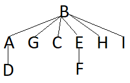
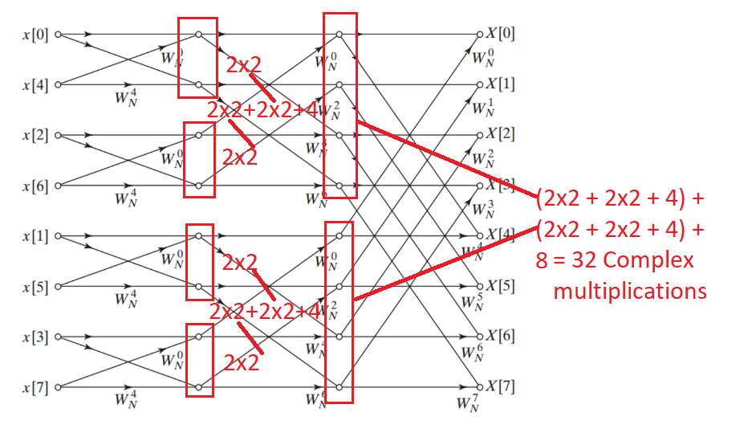
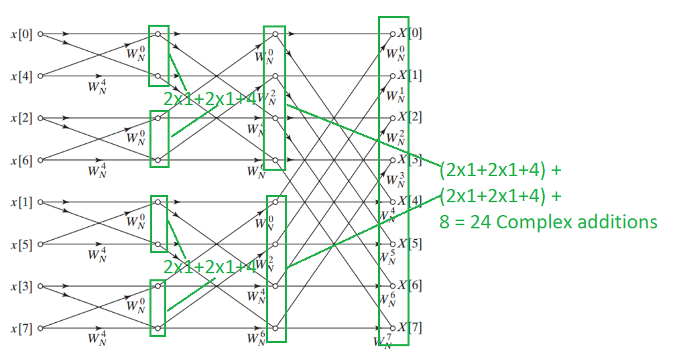

#COMP261 Assignment 3 Answers

##Articulation points
Pseudocode of AP algorithm used.
```
let allNodes = collection of all the nodes in the graph
let articulationNodes = empty collection to store articulation points

loop until allNodes is empty 
    let rootNode = first node from allNodes
    let visitedNodes = empty collection to store nodes visited
    let rootChildCount = 0 // Used to find if root is an AP

    let fringe = empty stack for fringe elements
    loop until fringe is empty
        let node = peek from fringe
        let previousNode = parent of node

        if node.depth is set
            node.reachBack = node.depth = current fringe element depth
            add every node except the parent of node to node.children
            
            if node is a direct child of rootNode and previousNode is rootNode
                increment rootChildCount
        else if node.children is not empty
            let child = get and remove a node from node.children
            if child.depth is set
                node.reachBack = min(node.reachBack, child.depth)
            else
                add child to fringe with depth = node.depth + 1 and parent = node
            end if
        else 
            if node is not rootNode
                previousNode.reachBack = min(node.reachBack, previousNode.reachBack)
                if node.reachBack >= previousNode.reachBack and previousNode has more than 1 child
                    add previousNode to articulationNodes
                end if
            end if
            remove node from fringe
        end if
    end loop

    if rootChildCount <= 1 // this indicates that the root was not an AP
        remove the root node from articulationNodes    
    end if

    remove every node inside visitedNodes from allNodes
end loop
```

###Depth and reachback
* A
    * Depth: 0
    * Reach-back: 0
    
* B
    * Depth: 1
    * Reach-back: 0
    
* C
    * Depth: 2
    * Reach-back: 2

* D
    * Depth: 3
    * Reach-back: 0
    
* E
    * Depth: 2
    * Reach-back: 0
    
* F
    * Depth: 5
    * Reach-back: 4
    
* G
    * Depth: 4
    * Reach-back: 4
    
* H
    * Depth: 4
    * Reach-back: 4
    
* I
    * Depth: 6
    * Reach-back: 4    

* J
    * Depth: 6
    * Reach-back: 6
    
###List of points
* B
    > C is a child of B that has a reach-back of 2 while B has a depth of 1, 
    this indicates that there are no alternative paths for C making B an AP
* D
    > D has two children which both have reach-back values higher than the depth of D
    indicating that D is an AP
* H
    > H has two children which both have reach-back values that are higher or equal to
    the depth of H which indicates that H is an AP
* F
    > F has the child J which has a reach back higher than the depth of F which indicates
    that F is an AP

---
##Minimum spanning tree
Pseudocode of MST algorithm used.
```
let djSet = disjoint set
let fringe = priority queue sorted by ascending segment length
let mst = collection of segments representing the minimum spanning tree
add all segments in graph to the fringe

loop until fringe is empty
    let segment = get and remove segment from fringe
    
    if not djSet.find(segment start, segment end) // Checks if start and end are not in the same disjoint set subtree
        djSet.union(segment start, segment end) // Merge the trees
        add segment to mst
    end if 
end loop
```

###Prim's algorithm
1. AD 2
2. DE 6
3. EF 3
4. BE 4
5. BG 1
6. BC 2
7. CH 4
8. HI 6

###Kruskal's algorithm
This is the tree of the disjoint set at the end of the algorithm. 

(This assumes that when Union(x, y) is called, x root becomes the parent of y root 
as long as the depth of y root is shorter or equal to the depth of x root)



If the Union method makes x the parent of y, then the 
following image will be the resulting tree.


##FFT
###Calculate complex multiplcations and additions
####Multiplication

####Addition:


###Order of 16 point time series
0 8 4 12 2 10 6 14 1 9 5 13 3 11 7 15